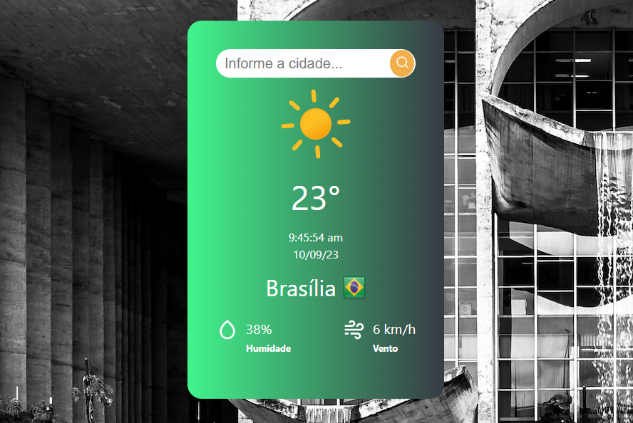

<div align="center">
  <a href="https://vitejs.dev/" target="blank"></a>
</div>

# WeatherHub

WeatherHub é o seu centro de informações meteorológicas, criado com React + Vite. Este aplicativo
fornece acesso instantâneo a previsões climáticas de diversas cidades ao redor do mundo.

## Stack Utilizada:

- react v18
- axios v1.5
- styled-components v6.0.7
- moment-timezone v0.5.43
- typescript v5

## Requisitos:

- Cadastro no site: https://openweathermap.org
- Criar um arquivo .env com a chave de acesso da\
  API (utilize como base o arquivo .env-example).

## Principais Scripts

- npm start: Inicia modo de desenvolvimento.
- npm run build: Cria um aplicativo para produção\
  na pasta build.

## Utilizando Docker

#### Criar a image:

```markdown
docker build -t weather-hub-image .
```

#### Criar o container:

```markdown
docker run --name weather-hub -d -p 80:80 weather-hub-image
```

<div align="center">
  
</div>
